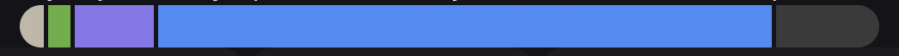

<!--
This README describes the package. If you publish this package to pub.dev,
this README's contents appear on the landing page for your package.

For information about how to write a good package README, see the guide for
[writing package pages](https://dart.dev/guides/libraries/writing-package-pages).

For general information about developing packages, see the Dart guide for
[creating packages](https://dart.dev/guides/libraries/create-library-packages)
and the Flutter guide for
[developing packages and plugins](https://flutter.dev/developing-packages).
-->

This package implements a simple stacked horizontal bar chart



# Usage

```dart
return StakedHorizontalBarChart(data:[
    StakedHorizontalBarChartData(units: 0.5, color: Colors.red),
    StakedHorizontalBarChartData(units: 0.2, color: Colors.blue),
    StakedHorizontalBarChartData(units: 0.3, color: Colors.green),
    ]);
```